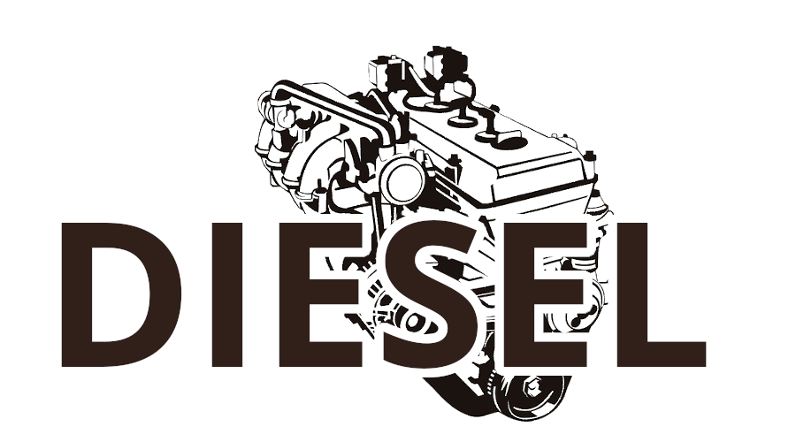
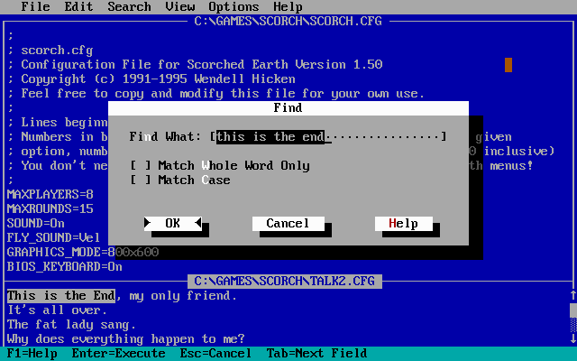

# Diesel
A text editor for any system. Diesel is influenced by edit.com from Microsoft DOS. Diesel features easy, functional extensions, and a very pleasant terminal user experience.

## Screenshots
A screenshot of Microsoft DOS in the Find panel while editing two files:

Diesel was designed by Luke I. Wilson.
